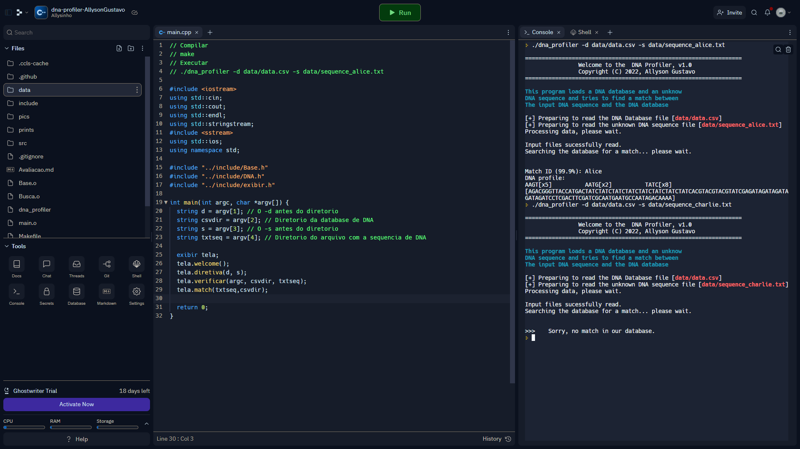

 # Prints
 - Adicionar na pasta *prints* pelo menos 3 imagens:
   - print da tela indicando a compilação concluída
   - print da tela indicando a execução de pelo menos um exemplo positivo

# Autoavaliação
- Ler e validar os argumentos da linha de comando | **15 / 15**
  - 0: não lê nem valida
  - 10: lê mas não valida 
  - 15: lê e valida
- Ler e validar os dados da base de dados e armazená-los em uma classe apropriada | **15 / 15**
  - 0: não lê nem valida 
  - 10: lê mas não valida 
  - 15: lê e valida 
- Separar a interface textual das demais classes do sistema concentrando os couts e cins em um único objeto | **10 / 10**
  - 0: não separou a interface textual 
  - 5: alguma interface textual ainda feita em diversas classes do sistema
  - 10: separação completa da interface textual
- Implementação de uma classe para armazenar e validar o DNA de um indivíduo bem como realizar as operações de perfil | **20 / 20**
  - 0: não implementou a classe 
  - 10: implementou a classe, porém algumas operações de perfil são realizadas fora da classe 
  - 20: implementação completa
- Implementação eficiente através do uso de referencias e contêineres da STL | **20 / 20**
  - 0: não usou contêiner da STL nem fez uso eficiente dos recursos computacionais
  - 10: usou contêiner da STL mas não otimizou uso dos recursos computacionais
  - 20: usou contêiner da STL junto a algoritmos e práticas de bom uso de recursos computacionais
- Organização do código em src, include, data | **2 / 5**
  - 0: não organizou o código
  - 5: organizou o código 
- Documentação do código | **2 / 5**
  - 0: não documentou o código
  - 5: documentou o código 
- Implementação e documentação de arquivos e procedimentos de compilação e teste | **0 / 10**
  - 0: não implementou arquivos e procedimentos de compilação e teste
  - 5: implementou alguns arquivos e procedimentos de compilação e teste (com alguma documentação) 
  - 10: Ampla implementação e documentação de arquivos e procedimentos de compilação e teste
 
 # Total
 **84** pontos
 
  - print da tela indicando a execução do exemplo negativo (não encontrado)
  