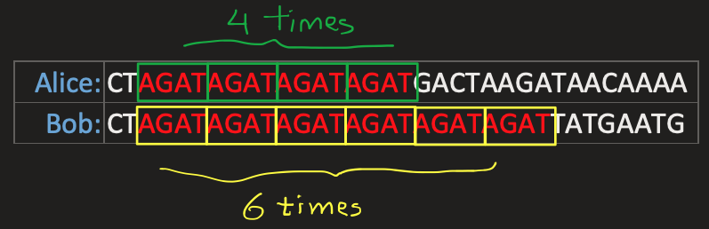
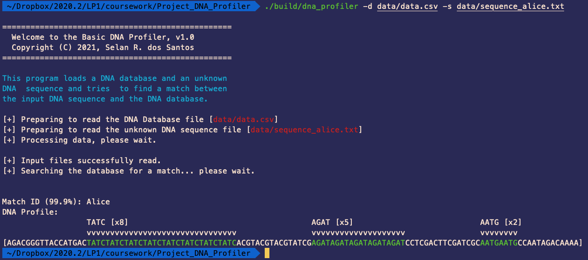
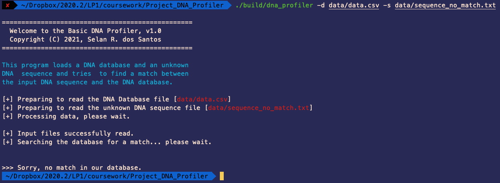

# DNA Profiler

### Table of Contents
1. [Introdução](#1-introdução)
2. [Background](#2-background)
3. [Entrada](#3-entrada)
4. [Interface](#4-interface)
5. [Execução](#5-execução)
6. [Modelagem do Problema](#6-modelagem-do-problema)
7. [Saída](#7-saída)

#  1. Introdução

Neste trabalho iremos desenvolver um programa de processamento de DNA. O programa, chamado **dna_profiler**[^1], deve receber duas entradas, representando 
dois arquivos: o primeiro, será um arquivo _[CSV](https://en.wikipedia.org/wiki/Comma-separated_values)_ que contém uma base de dados de DNA; o segundo é um 
arquivo de texto contendo a sequencia de DNA que deve ser verificada. O seu programa deverá, então, criar um perfil de DNA a partir da entrada e verificar se 
esse perfil está presente na base de dados. Em caso positivo, seu programa deverá imprimir na saída o nome da pessoa que tem o perfil encontrado; caso 
contrário, o programa deverá imprimir _"no match found"_.

[^1]: This assignment is a copy (with a few adaptations) of a programming project that may be found [here](http://nifty.stanford.edu/2020/dna/).

# 2. Background

O DNA, que carrega as informações genéticas dos seres vivos, é usado pela justiça há décadas. Mas como, exatamente, funciona o processo de criação de perfis de DNA?
Dada uma sequencia de DNA, como os investigadores identificam à quem aquele DNA pertence?

O DNA é apenas um conjunto de moléculas chamadas nucleotídeos, agrupadas em um formato particular (uma hélice dupla). Cada nucleotídeo do DNA contém
uma de quatro diferentes bases: adenina (`A`), citosina (`C`), guanina (`G`) e timina (`T`). Cada célula humana possui milhões desses nucleotídeos agrupados em sequência. Entre todos os humanos, algumas porções dessa sequencia são iguais, ou ao menos muito similares, mas outras partes têm uma alta diversidade genética, logo variando entre indivíduos.

Um ponto onde o DNA tende a ser muito diverso é nos [**Short Tandem Repeats** (STRs)](https://en.wikipedia.org/wiki/STR_analysis). Um STR é uma sequencia curta de DNA
que se repete uma determinada quantidade de vezes em lugares específicos do DNA. O número de vezes que um STR se repete varia muito entre as pessoas. No exemplo abaixo, Alice possui o STR `AGAT` repetido 4 vezes em seu DNA, enquanto que Bob tem o mesmo STR repetido 6 vezes.



Se usarmos múltiplos STRs, ao invés de apenas 1, podemos aumentar a acurácia do perfil. Se a probabilidade de duas pessoas terem o mesmo número de repetições de um STR
é de 5%, e os analistas usam 10 diferentes STR, a probabilidade de duas amostras de DNA serem iguais, apenas por sorte, é de 1 em um quadrilhão (assumindo que cada
STR é independente um do outro). Assim, se duas amostras de DNA têm o mesmo número de repetições de STRs, o analista é bem confiante que o DNA vem da mesma pessoa. 
O [CODIS](https://www.fbi.gov/services/laboratory/biometric-analysis/codis/codis-and-ndis-fact-sheet), a base de dados do FBI, usa 20 STRs diferentes como parte
da análise de amostras de DNA.

Na forma mais simples, você pode imaginar uma base de dados de DNA formatada em um _CSV_, onde cada linha corresponde a um indivíduo e cada coluna corresponde a
um STR particular.

```
name,AGAT,AATG,TATC
Alice,28,42,14
Bob,17,22,19
Charlie,36,18,25
```

Pelos dados acima, Alice tem a sequencia `AGAT` repetida 28 vezes em algum lugar de seu DNA, bem como as squencias `AATG` e `TATC` repetidas 42 e 14 vezes, 
respectivamente. De forma similar, o arquivo contém as repetições das sequencias para Bob e Charlie (17, 22 e 19 para Bob e 36, 18 e 25 para Charlie). Dessa forma, dada uma sequencia de DNA, como você identificaria quem é dono? 

Bem, imagine que você busque na sequencia de DNA pela sequencia mais longa de `AGAT` e encontre que ela tem tamanho 17 (uma sequencia de 17 `AGAT` consecutivos). Depois, voce repete o processo para `AATG` e descobre que ela se repete 22 vezes, e por fim `TATC` se repete 19 vezes. É bem provavel que este DNA pertença à Bob. Também é possível que, depois que fizermos os procedimentos, ainda assim ninguem na base de dados bata com as características encontradas, nesse caso você tem um "no match".

Na prática, os analistas sabem as localizações em que uma determinada STR vai ser encontrada no DNA, assim eles podem realizar buscas localizadas em apenas uma
porção do DNA ao invés de analisar toda a estrutura, porém esse detalhe será ignorado por nós neste trabalho.

Portanto, seu trabalho é escrever um sistema que receberá uma sequencia de DNA e uma base de dados contendo alguns perfis de indivíduos e verificar se o DNA recebido
está presente na base ou não.

# 3. Entrada

Você deverá ler dois arquivos de texto, um representado no formato CSV, contendo a base de dados, e outro contendo uma sequencia de DNA de um indivíduo que queremos
identificar.

## 3.1 A base de dados de DNA

A base de dados é basicamente uma tabela no seguinte formato:

1. Primeira linha: contém os nomes das colunas separadas por ','. A primeira coluna é sempre "name", seguida por uma quantidade 'n' de STRs que devem ser
considerados ao analisar as sequencias de entrada.
2. Uma quantidade _não determinada_ de linhas, cada uma contendo o nome de um indivíduo e seu perfil de DNA correspondente, na forma do número máximo que
uma sequencia de STRs repetidos aparecem em seu DNA.

A entrada, apresentada no inicio deste documento representa a tabela abaixo:

| name | `AGAT` | `AATG` | `TATC`
|:--------:| -------------:|-------------:|-------------:|
| Alice | 28 | 42 | 14
| Bob | 17 | 22 | 19
| Charlie | 36 | 18 | 25

## 3.2 A sequencia de DNA do indivíduo

O segundo arquivo representa o segmento de DNA do indivíduo, que deve ser analisado:

Este é o segmento do DNA de Alice:
> AGACGGGTTACCATGACTATCTATCTATCTATCTATCTATCTATCTATCACGTACGTACGTATCGAGATAGATAGATAGATAGATCCTCGACTTCGATCGCAATGAATGCCAATAGACAAAA

Este é o de Bob:
> AACCCTGCGCGCGCGCGATCTATCTATCTATCTATCCAGCATTAGCTAGCATCAAGATAGATAGATGAATTTCGAAATGAATGAATGAATGAATGAATGAATG

E este é o de Charlie:
> CCAGATAGATAGATAGATAGATAGATGTCACAGGGATGCTGAGGGCTGCTTCGTACGTACTCCTGATTTCGGGGATCGCTGACACTAATGCGTGCGAGCGGATCGATCTCTATCTATCTATCTATCTATCCTATAGCATAGACATCCAGATAGATAGATC

Claro que nós já sabemos quem é o dono das sequencias mostradas à cima, mas seu programa não sabe. Por isso o programa deve receber o DNA como entrada
e procurar pela sequencia mais longa com consecutivos STRs de acordo com nossa base de dados.

Os arquivos da base de dados e dos segmentos de DNA estão disponíveis [aqui](data).

# 4. Interface

Seu programa, chamado `dna_profiler`, deve ler da linha de comando da seguinte forma:
```
% ./dna_profiler
Usage: dna_profiler -d <database_file> -s <dna_sequence_file>
  Where the arguments are:
      <database_file>     The DNA database file.
      <dna_sequence_file> The DNA sequence file you wish to identify (find a match for).
```

# 5. Execução

Depois de receber os arquivos pelo terminal, o programa deve: (1) abrir o arquivo `.csv` e ler o seu conteúdo, (2) abrir o arquivo de DNA e ler o seu conteúdo. Depois
disso, o programa deve realizar o processamento do DNA recebido e procurar se o perfil resultante do processamento está presente na base de dados. Caso o perfil
identifique alguém da base de dados, o programa deve imprimir o nome da pessoa, caso contrário o programa deverá imprimir "no match found".

Abaixo seguem alguns passos de "alto nível" que podem ser usados por você para resolver o problema:

```
[1] Leia a base de dados e armazene as informações em um objeto apropriado.
[2] Leia a sequencia de DNA e armazene em __outro__ objeto apropriado.
[3] Gere o perfil da sequencia de DNA carregada.
[4] Procure pelo perfil gerado na base de dados.
	[4.a] Se o indivíduo for encontrado, imprima seu nome e mostre os STRs.
	[4.b] Caso contrário imprima que foi um "no match"
```

# 6. Modelagem do Problema

Você pode criar quantas classes achar necessário, mas faça ao menos 3:

+ Uma classe para armazenar a base de dados e realizar busca de perfis.
+ Uma classe para armazenar a informação de DNA de um indivíduo, bem como identificar o seu perfil com base em algum STR (ou conjunto de STR)
+ Uma classe para centralizar as saídas para o usuário

# 7. Saída

A saída do programa deve ser da seguinte forma no caso de um perfil ser encontrado na base:



Se for um "no match":



A saída deve ser exatamente como mostrada nas imagens. O uso de cores é um desafio adicional!

## Authorship

**Brian Yu, Harvard University,  [brian@cs.harvard.edu](http://nifty.stanford.edu/2020/dna/brian@cs.harvard.edu)**

**David J. Malan, Harvard University,  [malan@harvard.edu](mailto:malan@harvard.edu)**


**Adaptation: Selan R. Santos, [selan@dimap.ufrn.br](mailto:selan@dimap.ufrn.br)**

**Translation to Pt-Br and Further Adaptation: Julio Melo, [julio@imd.ufrn.br](mailto:julio@imd.ufrn.br)**

**Current adaptation (based on previous above): Renan Moioli, [renan.moioli@imd.ufrn.br](mailto:renan.moioli@imd.ufrn.br)**


